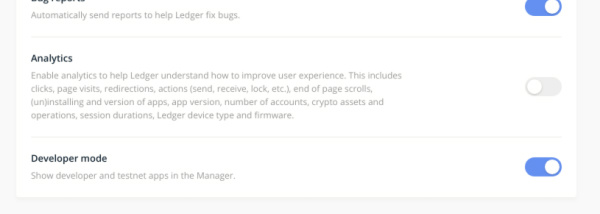

> This repo is archived as of June 29, 2020 but made available for historical record. If you are looking for the maintained version of this code please see [@cosmos/ledger-cosmos](https://github.com/cosmos/ledger-cosoms).
# Ledger-Cosmos

This repository contains:

  - Ledger Nano S/X Cosmos BOLOS app
  - Specs / Documentation 
  - C++ unit tests
  - Fuzzing scripts

Source code for apps is linked as submodules to allow for Ledger's build infrastructure.

For development purposes, this repo is recommended as it includes unit tests, tools, etc.

## Installing

### Cosmos app

The Cosmos app is already available in [Ledger Live](https://www.ledger.com/pages/ledger-live). Our preferred and recommended hardware wallet!

- Open Ledger Live and go to Settings (gear icon on the right):

- Enable developer mode (last option):

- Now go back to manager and search for Cosmos:

## Building

The following document describes how to build the apps: [Build instructions](docs/BUILD.md)

## Fuzzing

The following document provides more information on fuzzing the user app: [Fuzzing](fuzzing/fuzzing.md)

## Specifications

**Cosmos App**

  - [APDU Protocol](https://github.com/cosmos/ledger-cosmos-app/tree/master/docs/APDUSPEC.md)
  - [Transaction format](https://github.com/cosmos/ledger-cosmos-app/tree/master/docs/TXSPEC.md)

